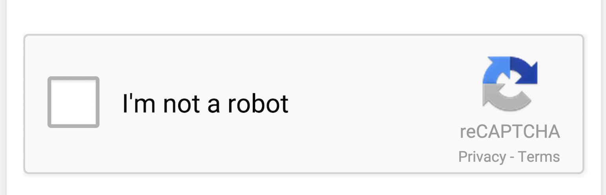
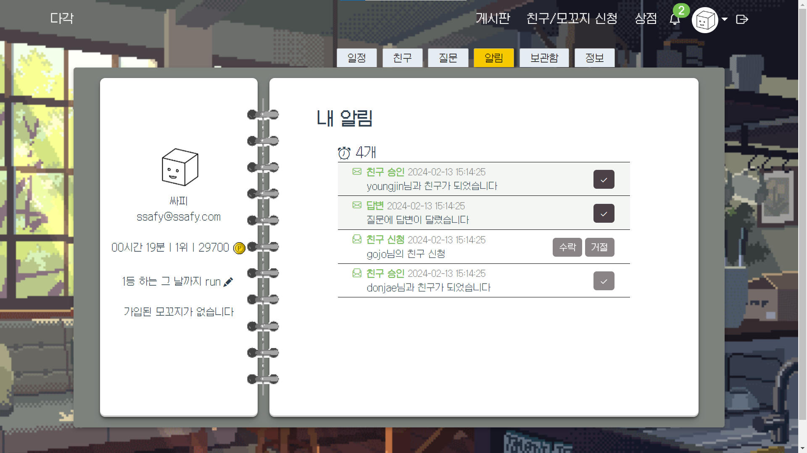

## 목차  
[1. 서비스 소개](#1-서비스-소개)  
[2. 개발환경](#2-개발환경)  
[3. 시스템 아키텍처](#3-시스템-아키텍처)  
[4. ERD](#4-erd)  
[5. 주요 기능](#5-주요-기능)  
[6. 기술적 차별점](#6-기술적-차별점)  
[7. 서비스 화면](#7-서비스-화면)  
[8. 맡은 역할](#8-맡은-역할) 

---
<b>기획 배경</b>

- 혼자 공부하는데 의지가 꺾이는 사람들을 위해서, 같은 목표를 가진 사람들을 소개하고 함께 체계적인 공부환경을 제공할 수 없을까?

<b>목표</b>

- 같은 과목을 공부하는 사람들을 신속하게 매칭시켜줄 수 있다
- 공부 스케쥴의 시스템적인 관리를 통해 공부 능률을 올려줄 수 있다

 

---
<b>기술스택</b>

- Front-End:  
- Back-End:  
- Database:  
 

<b>프로젝트 기간, 인원</b>

- 2024.01.02 ~ 2024.02.16 (7주)
- 백엔드 4명, 프론트엔드 2명

 

---
 

    

 

---

 

---

  
    
    
    
    
    

  

- **체계적인 공부환경** : 오늘의 공부 스케쥴(이하 다각)에 따라서 자동으로 공부시간 관리/스터디룸 관리를 해줍니다.  

- **맞춤형 스터디룸** : 나와 같은 목표를 가진 사람들을 매칭해줍니다.  

- **신속한 공부환경** : 시작과 동시에 랜덤 매칭으로 즉시 스터디룸에 입장시켜줍니다.  

- **함께하는 모꼬지** : 모임에 가입하고 함께 공부할 수 있습니다.  

- **맞춤형 아바타** : 공부시간에 따른 포인트 지급으로 자신의 아바타를 꾸밀 수 있습니다.  
 

 

## 1. Recapcha

구글API를 이용한 브루트포스 / 매크로 방지

  
    

## 2. 다각 생성 로직

공부 과목 갯수와 일정에 따른 다각형 모양

  
    
    
    
    

## 3. 실시간 상호작용

사용자와 서버와의 웹소켓 통신과,구독/발행을 통해 실시간 상호작용 시스템

  
    

---

### 1. 메인

### 2. 유저/모꼬지 랭킹
> 모꼬지란? '놀이·잔치 그 밖의 다른 일로 여러 사람이 모이는 것'이라는 뜻의 순우리말입니다.

 |
--- | --- |  

### 3. 스터디룸

### 4. 친구/모꼬지 신청, 모꼬지 페이지

### 5. 마이페이지
- 스케줄 관리

- 친구, 질문, 알림 목록 

  
    
    
    

- 보관함

- 정보

### 6. 상점

 

---

### 최영진
- **프론트엔드 담당**
    - Vue3, Pinia(상태 관리 라이브러리), scss, eslint, prettier

- **담당 기능**
  
    1. **vue 디렉토리 구조 구축**
    
    2. **회원가입, 로그인**
    3. **마이페이지**
        1. **스케줄 관리**
            - 유저만의 공부루틴을 생성하고, 스케줄러에 추가, 수정, 삭제가 가능합니다.
            - 스케줄에 추가 버튼을 통해 추가가 가능하며, 달력에서 날짜를 직접 선택하는 것도 가능합니다.
            - vue-datepicker의 multiple 기능을 활용하여 날짜를 중복선택이 가능하게 구현했습니다.
              
        2. **친구 관리**
            - 친구 목록과 친구의 상세정보를 볼 수 있습니다.
            - openVidu의 세션과 비교하여 친구의 접속중/접속해제 상태를 확인할 수 있습니다.
        3. **질문 관리**
            - 스터디룸에서 질문한 질문과 답변 목록을 볼 수 있습니다.
            - 질문 했을 시에는 Redis에 저장되며, 질문에 답변이 달렸으면 MySQL에 저장됩니다.
        4. **알림 관리**
            - 친구 신청, 모꼬지 신청, 질문에 답변이 달렸을 경우 알림이 오도록 구현했습니다.
            - 친구/모꼬지 신청 알림의 경우 수락과 거절 버튼이 보여지고 질문 알림에는 확인 버튼만 보여집니다.
        5. **보관함**
            - 상점에서 구매한 아이템과 현재 착용중인 아이템을 보여줍니다.
            - 같은 부위의 아이템은 중복 착용이 불가능하게 구현했습니다.
            - 아바타 저장을 누르면 이미지가 Amazon S3에 저장되며, MySQL의 user_picture 컬럼에 업데이트됩니다.
    4. **친구/모꼬지 신청**
        - 유저 전체 목록이 보여지고 현재 나와 친구인 경우에는 친구신청 버튼이 disable되어 보여집니다.
        - 친구 신청을 중복으로 보낼 수 없게 구현하였습니다.
        - 모꼬지 이름을 클릭하면 상세 모꼬지 페이지로 이동합니다.
          
            1. **모꼬지 상세 페이지**
                - 모꼬지 가입 여부, 모꼬지 대장 여부 등을 확인하여 모꼬지 탈퇴, 삭제 버튼이 다르게 보여집니다.
                - 모꼬지 대장의 경우에는 모꼬지원 강퇴가 가능하며, 모꼬지 수정이 가능합니다.
                  
    5. **상점 디자인/기능**
